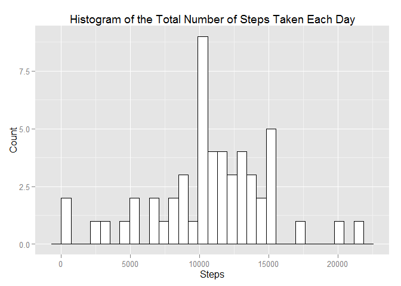
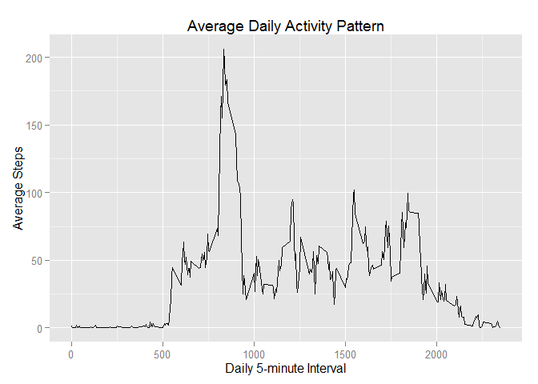
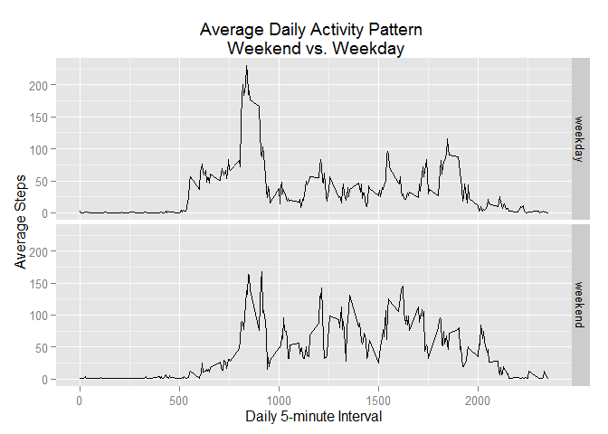

# Reproducible Research: Assignment 1
Dan Harris  
April 2016  
******


###Loading and preprocessing the data


```r
library(dplyr)
library(lubridate)
activity.data <- read.csv(file = "activity.csv", header = T)

activity.data <- activity.data %>%
  mutate(date = ymd(date), weekend = ifelse(wday(activity.data$date) == 1 | wday(activity.data$date) == 7, 1, 0))
```

******  
###What is the mean total number of steps taken per day?
  

```r
library(ggplot2)
options(scipen=999)

activity.data.meansteps <- activity.data %>%
  na.omit() %>%
  group_by(date) %>%
  summarize(Total = sum(steps))

g <- ggplot(data = activity.data.meansteps, aes(Total))

g + geom_histogram(fill = "white", col = "black") + labs(title = "Histogram of the Total Number of Steps Taken Each Day", x = "Steps", y = "Count")
```



```r
mean.steps <- round(mean(activity.data.meansteps$Total))
median.steps <- round(median(x = activity.data.meansteps$Total))
rm(activity.data.meansteps)
```

The **mean** number is steps taken each day is **10766**. The **median** number of steps taken each day is **10765**.  

******  
###What is the average daily activity pattern?
  

```r
activity.data.dailypattern <- activity.data %>%
  na.omit() %>%
  group_by(interval) %>%
  summarize(Mean = mean(steps)) %>%
  mutate(Rank = dense_rank(Mean))
  
  g <- ggplot(data = activity.data.dailypattern, aes(x=interval, y = Mean))

  g + geom_line() + 
  labs(title = "Average Daily Activity Pattern", x = "Daily 5-minute Interval", y = "Average Steps")
```



```r
max.interval <- activity.data.dailypattern$interval[which(activity.data.dailypattern$Rank == max(activity.data.dailypattern$Rank))]
```
  
The 5-minute interval, on average across all the days in the dataset, that contains the **maximum** number of steps is interval **835**. 
  
******  
###Impute missing values  
  

```r
missing.vals <- sum(!complete.cases(activity.data))
```

The total number of **missing values** in the dataset (i.e. the total number of rows with NAs) is **2304**.  

To impute the missing values, let's use a linear model with the following predictor variables.  

1. Interval
2. Whether the activity occurred on a weekday or on the weekend  


```r
library(broom)
fitted <- lm(steps ~ as.factor(interval) + weekend, data = activity.data, na.action = na.omit)

fitted.df <- tidy(fitted, row.names = F)
names(fitted.df) = c("interval","estimate","std.error","statistic", "p.value")

fitted.df$interval <- gsub(pattern = "as.factor\\(interval)", replacement =  "", fitted.df$interval)

activity.data.model <- inner_join(x = activity.data, y = activity.data.dailypattern, by = "interval")

activity.data.model$interval <- as.character(activity.data.model$interval)

activity.data.model <- left_join(x= activity.data.model, y = fitted.df, by = "interval")

activity.data.model$estimate <- ifelse(activity.data.model$p.value > 0.10 | is.na(activity.data.model$p.value), 0, activity.data.model$estimate)

activity.data.model <- activity.data.model %>%
  select(steps, date, interval, weekend, estimate)

impute.data <-  function(dat) {
  yint <- fitted.df$estimate[1]
  wknd <- fitted.df$estimate[length(fitted$coefficients)]
  dat$imputed_steps <- ifelse(is.na(dat$steps), as.integer(round(yint + dat$estimate + dat$weekend * wknd)), as.integer(dat$steps)) 
  imputed.data <<- dat %>%
    select(imputed_steps, date, interval) %>%
    rename(steps = imputed_steps)
  }

impute.data(activity.data.model)

rm(activity.data)
rm(activity.data.dailypattern)
rm(fitted)
rm(fitted.df)
```

After imputing the data, here is a new histogram of the total number of steps taken each day:  


```r
imputed.data.meansteps <- imputed.data %>%
group_by(date) %>%
summarize(Total = sum(steps))

g <- ggplot(data = imputed.data.meansteps, aes(Total))

g + geom_histogram(fill = "white", col = "black") + labs(title = "Histogram of the Total Number of Steps Taken Each Day", x = "Steps", y = "Count")
```


```r
imputed.mean.steps <- round(mean(imputed.data.meansteps$Total))
imputed.median.steps <- round(median(x = imputed.data.meansteps$Total))
rm(imputed.data.meansteps)
```

After imputing the data, the **mean** number of steps taken each day is **10603**. The **median** number of steps taken each day is **10571**. These numbers vary only slightly from the non-imputed data, and there is no significant effect from imputing the missing values in the chosen manner. This is because the number of missing values is rather small compared to the entire dataset, and we chose an imputation method that produces predicted values centered around the previous interval means.  

******
###Are there differences in activity patterns between weekdays and weekends?  


```r
imputed.data.weekday <- imputed.data %>%
  mutate(day = as.factor(ifelse(wday(imputed.data$date) == 1 | wday(imputed.data$date) == 7, "weekend", "weekday")))

imputed.data.weekday <- imputed.data.weekday %>%
  group_by(interval, day) %>%
  summarize(Mean = mean(steps))

g <- ggplot(data = imputed.data.weekday, aes(x = as.integer(interval), y = Mean))

g + geom_line() + 
  facet_grid(day~.) +
  labs(title = "Average Daily Activity Pattern \n Weekend vs. Weekday", x = "Daily 5-minute Interval", y = "Average Steps")
```


  
As evidenced here, there is a distinct difference in the daily activity pattern between weekends and weekdays.  On weekdays, it appears as though people tend to take more steps in the morning (perhaps on their commute to work), but take fewer steps than on the weekends over the rest of the day (perhaps due to being mostly seated at a desk during the work day).  

******
